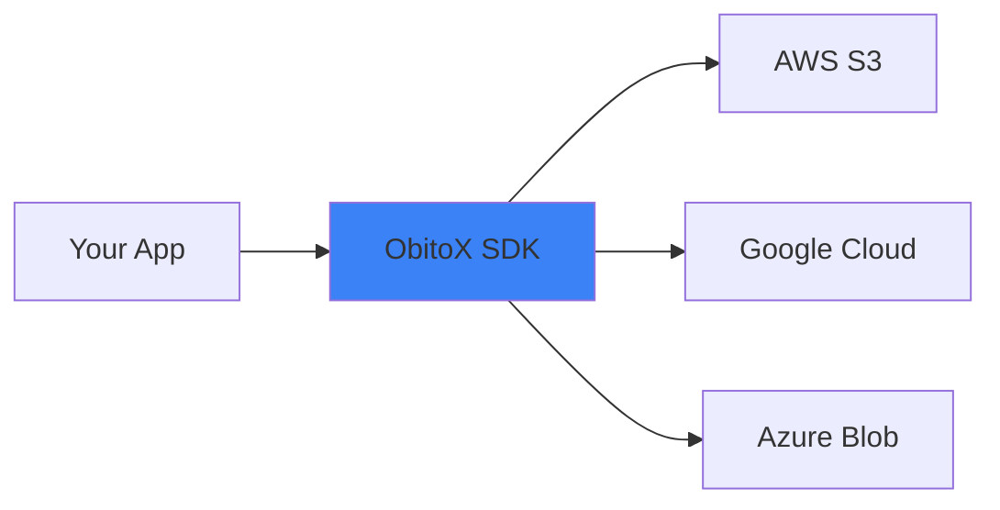

## Overview

ObitoX gives you a single, modern SDK to work with any storage provider. You write code once and switch providers without rewriting your integration. It handles AWS S3, Google Cloud Storage, Azure Blob Storage, and more through one unified API.

<Callout kind="info">
ObitoX abstracts provider-specific quirks, so you focus on your app instead of storage APIs.
</Callout>

## Key Features

ObitoX simplifies storage integration with these core capabilities:

<Columns cols={3}>
  <Card title="Unified API" icon="code" href="#quick-start">
    One interface for uploads, downloads, listings, and deletions across all providers.
  </Card>
  <Card title="Multi-Provider Support" icon="database" href="/providers">
    Works with AWS S3, Google Cloud Storage, Azure Blob, Backblaze B2, and others.
  </Card>
  <Card title="TypeScript Ready" icon="file-text" href="/quickstart">
    Full TypeScript support with auto-generated types for payloads and responses.
  </Card>
  <Card title="Streaming & Large Files" icon="upload-cloud" href="/advanced">
    Efficient streaming for massive files without loading everything into memory.
  </Card>
</Columns>

## Supported Storage Providers

ObitoX supports the most popular cloud storage services out of the box.

<Tabs>
  <Tab title="AWS" icon="cloud">
    Compatible with S3 buckets and compatible services like MinIO.
  </Tab>
  <Tab title="Google Cloud" icon="globe">
    Full integration with Google Cloud Storage buckets.
  </Tab>
  <Tab title="Azure" icon="microsoft">
    Works with Azure Blob Storage containers.
  </Tab>
  <Tab title="Others" icon="package">
    Backblaze B2, Cloudflare R2, and any S3-compatible provider.
  </Tab>
</Tabs>

## Why Choose a Universal SDK?

You avoid vendor lock-in and reduce maintenance. Instead of maintaining separate integrations for each provider, ObitoX handles differences in authentication, error handling, and API nuances.

<Callout kind="tip">
Switch providers in one config change—no code rewrites needed.
</Callout>

For example, upload a file with the same method regardless of backend:

<CodeGroup tabs="TypeScript,Python">
  ```typescript
  import { ObitoX } from 'obitox';

  const sdk = new ObitoX({ provider: 's3', accessKeyId: 'YOUR_ACCESS_KEY', secretAccessKey: 'YOUR_SECRET_KEY' });
  await sdk.upload('my-bucket', 'path/to/file.txt', fileBuffer);
  ```
  ```python
  from obitox import ObitoX

  sdk = ObitoX(provider='gcs', credentials='YOUR_SERVICE_ACCOUNT_JSON')
  sdk.upload('my-bucket', 'path/to/file.txt', file_content)
  ```
</CodeGroup>

## Quick Start

Get started in minutes.

<Steps>
  <Step title="Install" icon="download">
    Add ObitoX to your project.
    
    <CodeGroup tabs="npm,yarn,pnpm">
      ````bash
      npm install obitox
      ````
      ````bash
      yarn add obitox
      ````
      ````bash
      pnpm add obitox
      ````
    </CodeGroup>
  </Step>
  <Step title="Initialize" icon="settings">
    Create an instance with your provider config.
    
    ````typescript
    import { ObitoX } from 'obitox';

    const sdk = new ObitoX({
      provider: 's3',
      region: 'us-east-1',
      accessKeyId: `YOUR_ACCESS_KEY`,
      secretAccessKey: `YOUR_SECRET_KEY`,
    });
    ````
  </Step>
  <Step title="Upload a File" icon="upload">
    Use the unified methods.
    
    ````typescript
    const result = await sdk.upload('my-bucket', 'hello.txt', Buffer.from('Hello ObitoX!'));
    console.log(result.url);
    ````
  </Step>
</Steps>

## Next Steps

<Columns cols={2}>
  <Card title="Quickstart Guide" icon="rocket" href="/quickstart">
    Dive into full setup and examples.
  </Card>
  <Card title="Supported Providers" icon="database" href="/providers">
    Configure any storage service.
  </Card>
  <Card title="Authentication" icon="lock" href="/authentication">
    Secure your integrations.
  </Card>
  <Card title="API Reference" icon="book-open" href="/api">
    Complete method docs.
  </Card>
</Columns>

